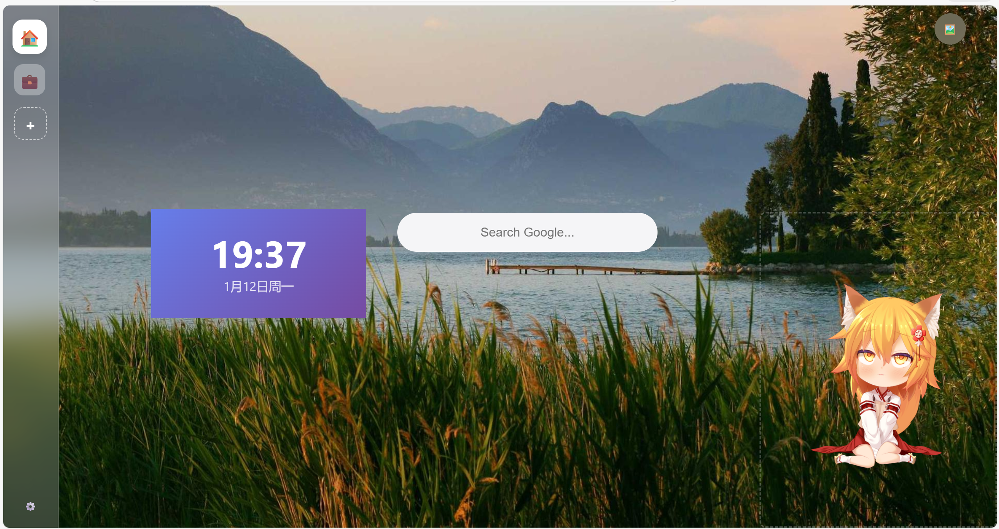

# 🎨 vvtab

**An Open-Source, Component-Based Browser New Tab Extension**

[](LICENSE)
[](CONTRIBUTING.md)

[Features](#-features) • [Preview](#-preview) • [Roadmap](#-roadmap) • [Getting Started](#-getting-started) • [中文](./README.md)

</div>

---

## 📖 Introduction

**vvtab** allows users to customize their browser's new tab page with a modular, component-based architecture. Build your dashboard like playing with LEGO blocks!

This project is currently in the early stages of development. I open-sourced it to invite developers and enthusiasts to collaborate. Let's build a beautiful and powerful start page together.

## 📸 Preview

> *Current development progress*



## ✨ Features

* **🧩 Component-Based**: Modular design where every widget is independent.
* **🎨 Highly Customizable**: Drag-and-drop layout to define your own workspace.
* **⚡ Lightweight**: Optimized for speed and performance.

## 🚀 Roadmap

We are actively working on the following features. Contributions are welcome!

- [ ] **Config Export/Import**: Support exporting user settings to JSON.
- [ ] **Cloud Backup**: Sync configurations across devices via the cloud.
- [ ] **More Components**: Weather, To-Do List, Calendar, RSS Reader, etc.
- [ ] **Live2D Integration**: Add Live2D pets/assistants to your new tab.
- [ ] **LLM Integration**: Access Large Language Models directly from the start page.

## 🛠️ Getting Started

For developers who want to contribute or build locally:

```bash
# 1. Clone the repository
git clone https://github.com/DITF16/vvtab.git

# 2. Install dependencies
npm install

# 3. Start development server
npm run dev
```
## 🤝 Contributing

PRs are welcome! Whether it's fixing bugs, suggesting features, or adding new components.

If you have experience in this kind of project, please do contact me! Let’s work together to improve vvtab.

## 📄 License

This project is licensed under the [MIT License](https://www.google.com/search?q=LICENSE&authuser=1).